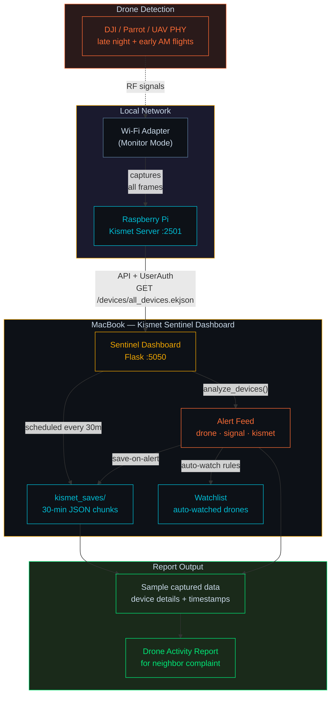

# Kismet Sentinel Dashboard

Real-time wireless monitoring dashboard for [Kismet](https://www.kismetwireless.net/). Single-file Flask app with drone detection, automated alert saves, device watchlists, and a dark cyberpunk UI.


<!--  -->


## Features

- **Device Monitor** — Live device table with MAC, SSID, PHY, manufacturer, signal strength, and last-seen timestamps. Filter by PHY type (802.11, Bluetooth, UAV) or search by any field.
- **Drone Detection** — Automatic alerting on drone/UAV keywords (DJI, Parrot, Skydio, etc.) and UAV PHY devices. Highlighted rows and dedicated drone filter.
- **Alert Feed** — Categorized alerts (drone, signal, kismet, save, error) with severity badges and timestamp. Filter by severity, poll Kismet's native alert feed.
- **Batch Saves** — Schedule recurring device snapshots or trigger manual saves. Full save log with file paths and device counts.
- **Save-on-Alert Automation** — Automatically save device details and/or traffic data to JSON when an alert fires. Configurable per data type.
- **Device Watchlist** — Watch specific devices manually from the detail panel, or automatically via rules (drone alerts, BTLE alerts, strong signal). "Save Watched Only" mode filters automated saves to watchlisted devices.
- **Demo Mode** — 29 dummy devices and 11 seed alerts for UI testing without a live Kismet instance.

## Quick Start

### With uv (recommended)

```bash
KISMET_DEMO=1 uv run --with flask --with apscheduler --with requests \
  python kismet-sentinel-dashboard.py --port 5050
```

### With pip

```bash
pip install -r requirements.txt
KISMET_DEMO=1 python kismet-sentinel-dashboard.py --port 5050
```

Open **http://localhost:5050** in your browser.

### Connect to Kismet

```bash
KISMET_URL=http://192.168.1.100:2501 \
KISMET_USER=kismet \
KISMET_PASS=yourpassword \
  python kismet-sentinel-dashboard.py
```

Or configure the connection from the **Config** tab in the UI.

## Environment Variables

| Variable | Default | Description |
|---|---|---|
| `KISMET_URL` | `http://localhost:2501` | Kismet server URL |
| `KISMET_API_KEY` | *(empty)* | Kismet API key (alternative to user/pass) |
| `KISMET_USER` | *(empty)* | Kismet username |
| `KISMET_PASS` | *(empty)* | Kismet password |
| `KISMET_SAVE_DIR` | `./kismet_saves` | Directory for saved JSON files |
| `KISMET_DEMO` | `1` | Set to `0` to disable demo mode |

## CLI Options

```
python kismet-sentinel-dashboard.py [--host HOST] [--port PORT] [--save-dir DIR]
```

| Flag | Default | Description |
|---|---|---|
| `--host` | `0.0.0.0` | Bind address |
| `--port` | `5000` | Port number |
| `--save-dir` | `./kismet_saves` | Override save directory |

## API Endpoints

| Method | Path | Description |
|---|---|---|
| `GET/POST` | `/api/config` | Read/update Kismet connection settings |
| `GET` | `/api/status` | Kismet server status |
| `GET` | `/api/devices` | Device list (supports `?since=` for incremental) |
| `GET` | `/api/ssids` | SSID list from Kismet |
| `GET` | `/api/alerts` | Alert feed (supports `?severity=`, `?type=`, `?limit=`) |
| `POST` | `/api/alerts/clear` | Clear all alerts |
| `POST` | `/api/alerts/poll` | Pull alerts from Kismet |
| `POST` | `/api/save` | Trigger manual save |
| `GET` | `/api/save/log` | Save history log |
| `GET/POST` | `/api/schedules` | Manage scheduled saves |
| `DELETE` | `/api/schedules/<id>` | Remove a schedule |
| `GET/POST` | `/api/automations` | Read/update automation settings |
| `GET` | `/api/automations/saves` | List alert-triggered saves |
| `GET/POST` | `/api/watchlist` | List/add watched devices |
| `DELETE` | `/api/watchlist/<mac>` | Remove from watchlist |

## Automation Details

### Save-on-Alert

When enabled (default), every alert triggers a JSON save containing:

- **Device Details** — MAC, PHY, manufacturer, signal, channel, timestamps
- **Device Traffic** — Packet counts, data size, encryption info

Files are written to `kismet_saves/alert_<type>_<device>_<timestamp>.json`.

### Auto-Watch Rules

Devices are automatically added to the watchlist when they trigger matching alerts:

| Rule | Default | Watches on |
|---|---|---|
| Drone Alerts | On | Any drone/UAV detection alert |
| BTLE Alerts | On | Bluetooth/BTLE signal or kismet alerts |
| Strong Signal | Off | Signal above -60 dBm |

### Save Watched Only

When enabled, automated saves are filtered to only include devices in the watchlist. Useful for focusing on specific targets during monitoring.

## Architecture



## Design

Single-file architecture — the entire dashboard (Python backend, HTML, CSS, JavaScript) lives in one `.py` file for easy deployment. The UI uses a dark wireframe aesthetic with Share Tech Mono and Barlow Condensed fonts, amber accent colors, and a scanline overlay effect.

## License

MIT
