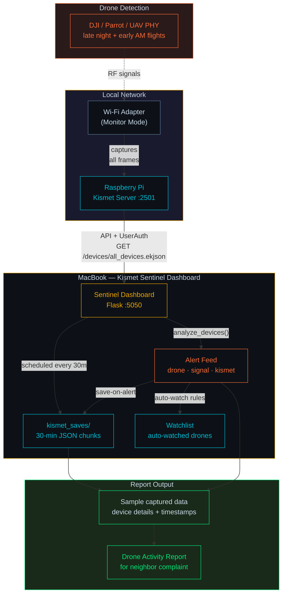

```mermaid
graph TB
    subgraph FIELD["Local Network"]
        direction TB
        PI["Raspberry Pi<br/>Kismet Server :2501"]
        WIFI["Wi-Fi Adapter<br/>(Monitor Mode)"]
        WIFI -->|"captures<br/>all frames"| PI
    end

    subgraph MAC["MacBook — Kismet Sentinel Dashboard"]
        direction TB
        DASH["Sentinel Dashboard<br/>Flask :5050"]
        SAVES["kismet_saves/<br/>30-min JSON chunks"]
        ALERTS["Alert Feed<br/>drone · signal · kismet"]
        WATCH["Watchlist<br/>auto-watched drones"]
    end

    PI -->|"API + UserAuth<br/>GET /devices/all_devices.ekjson"| DASH
    DASH -->|"scheduled every 30m"| SAVES
    DASH -->|"analyze_devices()"| ALERTS
    ALERTS -->|"auto-watch rules"| WATCH
    ALERTS -->|"save-on-alert"| SAVES

    subgraph DETECT["Drone Detection"]
        direction LR
        DRONE["DJI / Parrot / UAV PHY<br/>late night + early AM flights"]
        DRONE -.->|"RF signals"| WIFI
    end

    subgraph REPORT["Report Output"]
        direction TB
        SAMPLE["Sample captured data<br/>device details + timestamps"]
        DOC["Drone Activity Report<br/>for neighbor complaint"]
        SAVES --> SAMPLE
        ALERTS --> SAMPLE
        SAMPLE --> DOC
    end

    style FIELD fill:#1a1a2e,stroke:#f0a500,color:#c8d8e8
    style MAC fill:#0d1117,stroke:#f0a500,color:#c8d8e8
    style DETECT fill:#2a1a1a,stroke:#ff6b35,color:#c8d8e8
    style REPORT fill:#1a2a1a,stroke:#00e676,color:#c8d8e8
    style PI fill:#0d1117,stroke:#00bcd4,color:#00bcd4
    style WIFI fill:#0d1117,stroke:#5a7a9a,color:#c8d8e8
    style DASH fill:#0d1117,stroke:#f0a500,color:#f0a500
    style SAVES fill:#0d1117,stroke:#00bcd4,color:#00bcd4
    style ALERTS fill:#0d1117,stroke:#ff6b35,color:#ff6b35
    style WATCH fill:#0d1117,stroke:#00bcd4,color:#00bcd4
    style DRONE fill:#2a1a1a,stroke:#ff6b35,color:#ff6b35
    style SAMPLE fill:#1a2a1a,stroke:#00e676,color:#c8d8e8
    style DOC fill:#1a2a1a,stroke:#00e676,color:#00e676
```
